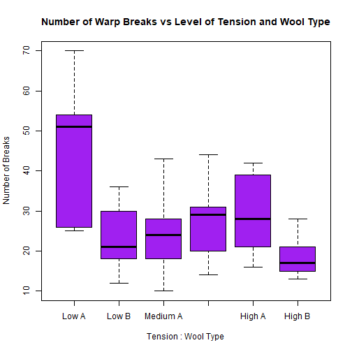

Shiny App Demo for Coursera Data Science Class
========================================================
author: David Carlos Garza
date: 02/28/2021
autosize: true

Purpose
========================================================

The Shiny app performs the following:

- Show my ability to create a simple Shiny app
- Simple example of factor selection and its impact on linear regression modeling
- Show my ability in creating this reproducible presentation

Data
========================================================

The _warpbreaks_ data describes how often warps break while weaving. The factors that determine the number of occurrences of warp breaks are tension and wool type. A summary of the data is provided.


```
     breaks      wool   tension
 Min.   :10.00   A:27   L:18   
 1st Qu.:18.25   B:27   M:18   
 Median :26.00          H:18   
 Mean   :28.15                 
 3rd Qu.:34.00                 
 Max.   :70.00                 
```

Exploratory Analysis
========================================================
The shiny app includes a plot for exploratory analysis. The user selects the factors of interest and then a box plot with the selected factors appears. An example box plot is provided.



Linear Regression Model
========================================================

A linear regression model is also run to determine if their are significant differences in the number of warp breaks dependent on wool type and tension. An example is provided below.


```r
model1<-lm(breaks~wool+tension,data=warpbreaks)
summary1<-summary(model1)
summary1$coefficients
```

```
              Estimate Std. Error   t value     Pr(>|t|)
(Intercept)  39.277778   3.161783 12.422667 6.681866e-17
woolB        -5.777778   3.161783 -1.827380 7.361367e-02
tensionM    -10.000000   3.872378 -2.582393 1.278683e-02
tensionH    -14.722222   3.872378 -3.801856 3.913842e-04
```


